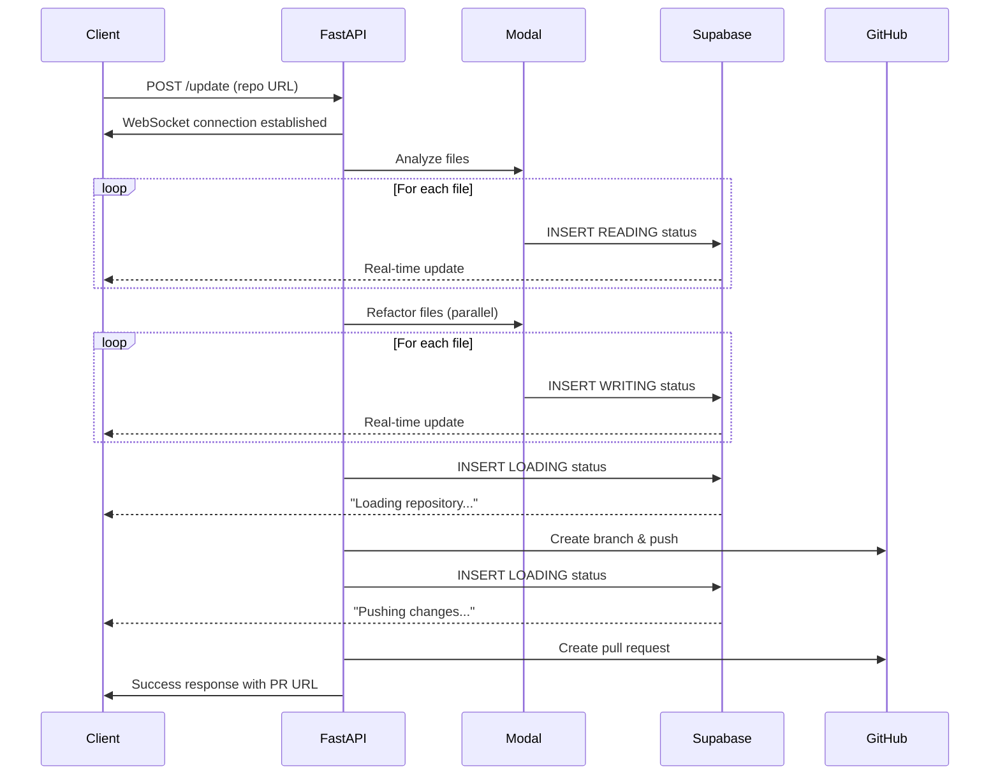

## Overview

Dependify provides **real-time progress updates** throughout the entire code modernization process using a combination of **WebSockets** and **Supabase real-time database subscriptions**. Users see live status updates as files are analyzed, refactored, and committed.

## Architecture

### Dual Update System

Dependify uses two complementary systems for real-time updates:

<CardGroup cols={2}>
  <Card title="WebSockets" icon="plug">
    **FastAPI WebSocket endpoint** for direct server-to-client communication
    
    - Bidirectional communication
    - Low latency
    - Connection-based
  </Card>
  
  <Card title="Supabase Real-Time" icon="database">
    **PostgreSQL real-time subscriptions** for persistent state tracking
    
    - Database-backed
    - Multiple client support
    - Survives reconnections
  </Card>
</CardGroup>

## WebSocket Integration

### Connection Manager

The system uses a custom connection manager to handle multiple clients:

```python socket_manager.py:6-32
class ConnectionManager:
    def __init__(self):
        self.active_connections: Dict[str, WebSocket] = {}

    async def connect(self, websocket: WebSocket, client_id: str):
        """Establish connection and add to active connections"""
        await websocket.accept()
        self.active_connections[client_id] = websocket

    async def disconnect(self, client_id: str):
        """Disconnect client from WebSocket"""
        try:
            del self.active_connections[client_id]
        except KeyError:
            pass

    async def send_personal_message(self, data: dict, websocket: WebSocket):
        """Send message to specific client"""
        await websocket.send_json(data)

    async def broadcast(self, data: dict):
        """Broadcast data to all connected clients"""
        for connection in self.active_connections.values():
            await connection.send_json(data)
```

### WebSocket Endpoint

```python server.py:419-440
@app.websocket("/ws")
async def websocket_endpoint(
    websocket: WebSocket,
    client_id: Optional[str] = Query(None)
):
    """
    WebSocket endpoint for real-time updates during repository processing.
    
    Clients can connect to receive live progress updates.
    """
    await manager.connect(websocket, client_id or "default")
    try:
        while True:
            data = await websocket.receive_json()
            await manager.broadcast(data)
    except WebSocketDisconnect:
        await manager.disconnect(client_id or "default")
        print(f"Client {client_id or 'default'} disconnected")
    except Exception as e:
        print(f"WebSocket error: {str(e)}")
        await manager.disconnect(client_id or "default")
```

### Client Connection

Connect from frontend JavaScript:

```javascript
const ws = new WebSocket('ws://localhost:8000/ws?client_id=user123');

ws.onopen = () => {
  console.log('Connected to Dependify WebSocket');
};

ws.onmessage = (event) => {
  const update = JSON.parse(event.data);
  console.log('Progress update:', update);
  updateDashboard(update);
};

ws.onerror = (error) => {
  console.error('WebSocket error:', error);
};

ws.onclose = () => {
  console.log('Disconnected from WebSocket');
};
```

<Info>
**Query Parameter:** The `client_id` parameter allows tracking individual users and sending targeted updates.
</Info>

## Supabase Real-Time Updates

### Database Schema

Supabase stores real-time status updates in the `repo-updates` table:

```sql
CREATE TABLE "repo-updates" (
  id UUID PRIMARY KEY DEFAULT uuid_generate_v4(),
  status VARCHAR(50),
  message TEXT,
  code TEXT,
  filename VARCHAR(255),
  created_at TIMESTAMP DEFAULT NOW()
);

-- Enable real-time
ALTER PUBLICATION supabase_realtime ADD TABLE "repo-updates";
```

### Status Updates During Analysis

When analyzing files, status updates are inserted:

```python checker.py:107-125
filename = file_path.split("/")[-1]
data = {
    "status": "READING",
    "message": f"📖 Reading {filename}",
    "code": chat_completion.code_content
}

try:
    supabase_client = get_supabase_client()
    supabase_client.table("repo-updates").insert(data).execute()
except Exception as db_error:
    # Fallback without optional columns
    print(f"Database error: {db_error}")
    data_fallback = {
        "status": "READING",
        "message": f"📖 Reading {filename}"
    }
    supabase_client.table("repo-updates").insert(data_fallback).execute()
```

### Status Updates During Refactoring

```python modal_write.py:145-161
validation_emoji = "✅" if validation_result.is_valid else "⚠️"
print(f"{validation_emoji} {filename}: Processing complete")

# Update Supabase with clean status message
data = {
    "status": "WRITING",
    "message": f"✍️ Updating {filename}",
    "code": job_report.refactored_code
}

try:
    supabase_client.table("repo-updates").insert(data).execute()
except Exception as db_error:
    print(f"Database error: {db_error}")
    data_fallback = {
        "status": "WRITING",
        "message": f"✍️ Updating {filename}"
    }
    supabase_client.table("repo-updates").insert(data_fallback).execute()
```

### Status Updates During Git Operations

```python git_driver.py:102-106
data = {
    "status": "LOADING",
    "message": "Loading repository..."
}
supabase_client.table("repo-updates").insert(data).execute()
```

```python git_driver.py:150-155
data = {
    "status": "LOADING",
    "message": "Pushing changes to GitHub..."
}
supabase_client.table("repo-updates").insert(data).execute()
```

## Status Types

<Tabs>
  <Tab title="READING">
    **Analysis Phase**
    
    ```json
    {
      "status": "READING",
      "message": "📖 Reading Header.tsx",
      "code": "import React from 'react'...",
      "filename": "Header.tsx"
    }
    ```
    
    Indicates a file is being analyzed for outdated patterns.
  </Tab>
  
  <Tab title="WRITING">
    **Refactoring Phase**
    
    ```json
    {
      "status": "WRITING",
      "message": "✍️ Updating api.js",
      "code": "async function fetchData...",
      "filename": "api.js"
    }
    ```
    
    Indicates a file is being refactored with modern syntax.
  </Tab>
  
  <Tab title="LOADING">
    **Git Operations**
    
    ```json
    {
      "status": "LOADING",
      "message": "Loading repository..."
    }
    ```
    
    ```json
    {
      "status": "LOADING",
      "message": "Pushing changes to GitHub..."
    }
    ```
    
    Indicates Git operations are in progress.
  </Tab>
</Tabs>

## Frontend Integration

### Supabase Client Setup

```javascript
import { createClient } from '@supabase/supabase-js';

const supabase = createClient(
  process.env.NEXT_PUBLIC_SUPABASE_URL,
  process.env.NEXT_PUBLIC_SUPABASE_KEY
);
```

### Real-Time Subscription

```javascript
const channel = supabase
  .channel('repo-updates')
  .on(
    'postgres_changes',
    {
      event: 'INSERT',
      schema: 'public',
      table: 'repo-updates'
    },
    (payload) => {
      const update = payload.new;
      console.log('New update:', update);
      
      // Update UI based on status
      switch (update.status) {
        case 'READING':
          showAnalysisProgress(update.message, update.filename);
          break;
        case 'WRITING':
          showRefactoringProgress(update.message, update.filename);
          break;
        case 'LOADING':
          showGitProgress(update.message);
          break;
      }
    }
  )
  .subscribe();
```

### Progress Bar Component

```jsx
import { useState, useEffect } from 'react';
import { createClient } from '@supabase/supabase-js';

export default function ProgressTracker() {
  const [updates, setUpdates] = useState([]);
  const [currentFile, setCurrentFile] = useState(null);
  
  useEffect(() => {
    const supabase = createClient(
      process.env.NEXT_PUBLIC_SUPABASE_URL,
      process.env.NEXT_PUBLIC_SUPABASE_KEY
    );
    
    const channel = supabase
      .channel('updates')
      .on(
        'postgres_changes',
        { event: 'INSERT', schema: 'public', table: 'repo-updates' },
        (payload) => {
          const update = payload.new;
          setUpdates(prev => [...prev, update]);
          setCurrentFile(update.filename);
        }
      )
      .subscribe();
    
    return () => {
      supabase.removeChannel(channel);
    };
  }, []);
  
  return (
    <div className="progress-tracker">
      <h3>Current: {currentFile}</h3>
      <div className="updates-list">
        {updates.map((update, i) => (
          <div key={i} className={`update update-${update.status.toLowerCase()}`}>
            <span className="status">{update.status}</span>
            <span className="message">{update.message}</span>
          </div>
        ))}
      </div>
    </div>
  );
}
```

## Dashboard Live Updates

### Progress Indicators

```javascript
function updateDashboard(update) {
  const { status, message, filename } = update;
  
  // Update progress bar
  const progressBar = document.getElementById('progress');
  const currentCount = parseInt(progressBar.dataset.current || 0);
  const totalCount = parseInt(progressBar.dataset.total || 0);
  
  if (status === 'READING' || status === 'WRITING') {
    progressBar.dataset.current = currentCount + 1;
    const percentage = (currentCount + 1) / totalCount * 100;
    progressBar.style.width = `${percentage}%`;
  }
  
  // Add to activity log
  const log = document.getElementById('activity-log');
  const entry = document.createElement('div');
  entry.className = `log-entry status-${status.toLowerCase()}`;
  entry.innerHTML = `
    <span class="timestamp">${new Date().toLocaleTimeString()}</span>
    <span class="status">${status}</span>
    <span class="message">${message}</span>
  `;
  log.prepend(entry);
  
  // Update current file indicator
  if (filename) {
    document.getElementById('current-file').textContent = filename;
  }
}
```

### Status Emojis

The system uses emojis for quick visual feedback:

```python server.py:243-245
conf_emoji = "🟢" if confidence >= 80 else "🟡" if confidence >= 60 else "🔴"
print(f"✅ Completed {i}/{len(job_list)}: {file_path} {conf_emoji}")
```

<CardGroup cols={4}>
  <Card title="Reading" icon="book-open">
    📖 File analysis
  </Card>
  <Card title="Writing" icon="pen">
    ✍️ Refactoring
  </Card>
  <Card title="Valid" icon="check">
    ✅ Success
  </Card>
  <Card title="Warning" icon="triangle-exclamation">
    ⚠️ Needs review
  </Card>
</CardGroup>

## Connection Management

### Reconnection Logic

```javascript
class ReconnectingWebSocket {
  constructor(url, options = {}) {
    this.url = url;
    this.reconnectInterval = options.reconnectInterval || 3000;
    this.maxReconnectAttempts = options.maxReconnectAttempts || 10;
    this.reconnectAttempts = 0;
    this.connect();
  }
  
  connect() {
    this.ws = new WebSocket(this.url);
    
    this.ws.onopen = () => {
      console.log('WebSocket connected');
      this.reconnectAttempts = 0;
    };
    
    this.ws.onmessage = (event) => {
      const data = JSON.parse(event.data);
      this.onMessage(data);
    };
    
    this.ws.onclose = () => {
      console.log('WebSocket disconnected');
      this.reconnect();
    };
    
    this.ws.onerror = (error) => {
      console.error('WebSocket error:', error);
    };
  }
  
  reconnect() {
    if (this.reconnectAttempts < this.maxReconnectAttempts) {
      this.reconnectAttempts++;
      console.log(`Reconnecting (${this.reconnectAttempts}/${this.maxReconnectAttempts})...`);
      setTimeout(() => this.connect(), this.reconnectInterval);
    } else {
      console.error('Max reconnection attempts reached');
    }
  }
  
  onMessage(data) {
    // Override in implementation
  }
}
```

## Performance Considerations

### Rate Limiting

Supabase updates are throttled to prevent overwhelming the database:

```python
# Updates are inserted only at key checkpoints:
# 1. When analysis starts for a file
# 2. When refactoring completes for a file
# 3. During major Git operations

# NOT on every intermediate step
```

### Message Batching

For large repositories, consider batching updates:

```javascript
let updateQueue = [];
let batchTimeout = null;

function queueUpdate(update) {
  updateQueue.push(update);
  
  if (batchTimeout) clearTimeout(batchTimeout);
  
  batchTimeout = setTimeout(() => {
    processBatch(updateQueue);
    updateQueue = [];
  }, 100); // Batch updates every 100ms
}

function processBatch(updates) {
  // Process all updates at once
  updates.forEach(update => updateDashboard(update));
}
```

<Warning>
**Connection Limits:** Supabase has concurrent connection limits on free tier. For production, upgrade to a paid plan or implement connection pooling.
</Warning>

## Monitoring & Debugging

### Server-Side Logging

```python server.py:244-247
if output and output.get("refactored_code"):
    print(f"✅ Completed {i}/{len(job_list)}: {file_path} {conf_emoji}")
else:
    print(f"⚠️ Skipped {i}/{len(job_list)}: No output")
```

### Client-Side Debugging

```javascript
// Enable debug mode
const DEBUG = true;

if (DEBUG) {
  console.log('WebSocket state:', ws.readyState);
  console.log('Active subscriptions:', supabase.getChannels());
  console.log('Last update:', lastUpdate);
}
```

## Complete Flow Example



## Next Steps

<CardGroup cols={2}>
  <Card title="Code Analysis" icon="magnifying-glass-chart" href="/features/code-analysis">
    Learn about parallel file analysis
  </Card>
  <Card title="API Reference" icon="code" href="/api/modernization/update-repo">
    Full API documentation
  </Card>
</CardGroup>